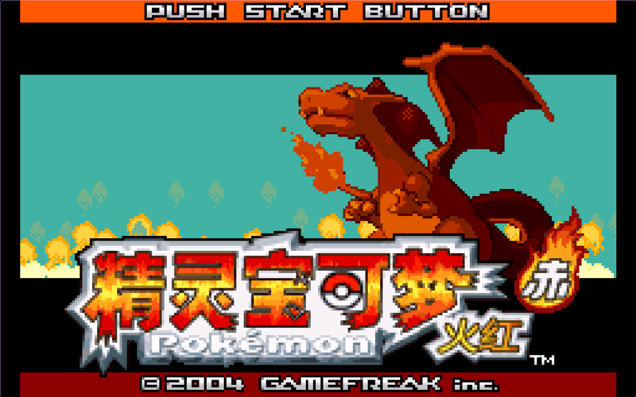
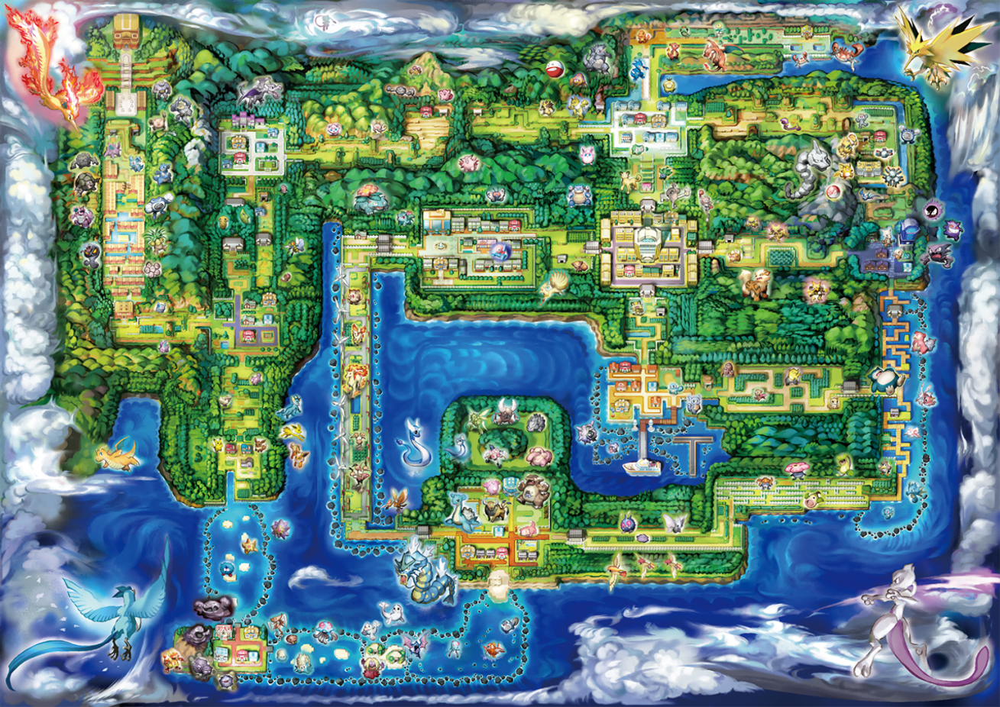
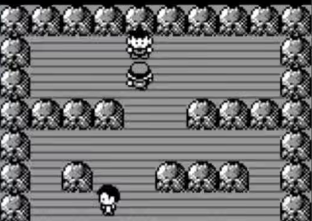

# PokeRL-Red-Evolved: Advanced Reinforcement Learning for Pokémon Red

<p align="center">
  
  
  
  
</p>


## 📝 Overview

<table align="center">
  <tr>
    <td align="center" width="50%">
        <br>
        The Title of PokemonRed
    </td>
    <td align="center" width="50%">
        <br>
        The Entire Map of the World
    </td>
  </tr>
</table>


This project implements a high-performance Reinforcement Learning agent based on the **PPO (Proximal Policy Optimization)** algorithm to play the classic RPG *Pokémon Red*.

By building upon the baseline framework, our team has introduced **14 systemic optimizations** spanning RAM state extraction, non-linear reward shaping, and algorithmic enhancements. The result is an agent that not only explores the world efficiently but also masters type-advantages in battle and executes complex story-driven sequences.

---

## 📈 Performance Benchmarks

Compared to the baseline models, our "Evolved" agent demonstrates significant improvements across all critical metrics:

| Metric                       | Baseline            | **PokeRL-Evolved**    |
|:-----------------------------|:--------------------|:----------------------|
| **Battle Win Rate**          | Not Supported       | **~90%**              |
| **Map Exploration Coverage** | 25%                 | **70%+**              |
| **Training Convergence**     | Baseline            | **3-6x Faster**       |
| **Pallet Town Exit**         | Not Supported       | **≤1300 Steps**       |
| **Catching Pokémon**         | Not Supported       | **~40% Success Rate** |
| **Advance the Plot**         | Not Supported       | **perfect**           |


### 📽️ Gameplay Demos
<table align="center">
  <tr>
    <td align="center" width="20%">
        <br>
        Player
    </td>
    <td align="center" width="50%">
        <br>
        Fighting with XiaoGang
    </td>
  </tr>
</table>

- [Battle & Capture Demo](assets/pokemon_mp4_FightAndCapture.mp4)
- [Plot Progression Demo](assets/pokemon_mp4_plot.mp4)

---

## ✨ Key Innovations

### 1. Deep Mechanics & Environment Integration

We moved beyond raw pixel input by leveraging direct RAM mapping to provide the agent with a "semantic" understanding of the game state:

* **Precision State Mapping**: Real-time tracking of battle status (`0xD057`), party size (`0xD163`), and world events via `events.json`.
* **Advanced Exploration Logic**: Implemented a multi-layered anti-stuck system that penalizes "map-hopping" (repeatedly entering/exiting doors) and "circular walking" through coordinate growth-rate detection.
* **Curriculum Learning**: Designed a staged reward pipeline that guides the agent through complex early-game sequences (Oak's Lab, Rival Battle, and exiting Pallet Town) using prioritized milestones.

### 2. Expert Reward Shaping

* **Non-linear Battle Rewards**: Instead of simple win/loss binary feedback, rewards are scaled based on damage efficiency. This encourages the agent to learn type-advantages (e.g., choosing *Vine Whip* over *Tackle* against rock types).
* **Catching & Diversity Reward**: A unique reward system for successful Pokémon captures and party diversity, incentivizing the agent to build a team rather than relying on a single starter.
* **Menu & Interaction Penalty**: Eliminated "menu-spamming" behaviors by penalizing unnecessary menu toggles during exploration, significantly increasing the effective training step rate.

### 3. Algorithmic Enhancements

Our optimization suite (`optimizations/`) includes 10 standalone modules to boost learning efficiency:

* **Advanced Prioritized Replay (PER)**: Samples transitions based on a hybrid of TD-error and **State Novelty**, ensuring the agent focuses on both difficult and rare experiences.
* **Curiosity-Driven Exploration**: Adds an intrinsic motivation signal based on prediction error, pushing the agent to explore "fog of war" areas on the map.
* **Adaptive Hyperparameter Scheduling**:

  * **Learning Rate**: Utilizes Cosine Annealing to allow for rapid initial progress and stable fine-tuning.
  * **Exploration Rate**: Dynamically decayed to balance discovery and exploitation as the policy matures.
* **Multi-Task Optimization**: Simultaneously optimizes for exploration efficiency, battle performance, and map coverage through weighted objective functions.

---

## 📂 Project Structure

```bash
PokemonRed-agent/
├── red_gym_env_v2.py       # Core: Deeply customized Gymnasium environment
├── baseline_fast_v2.py     # Training: Parallelized PPO training script (6 processes)
├── watch_trained.py        # Inference: Real-time visualization via Pygame
├── optimizations/          # Algorithmic Plugins
│   ├── advanced_optimization.py   # PER & Adaptive Scheduling
│   ├── curiosity_driven.py        # Intrinsic motivation logic
│   ├── exploration_reward.py      # Multi-layer exploration metrics
│   └── reward_optimization.py     # Weighted multi-objective calculator
├── events.json             # Data: RAM address mapping for story events
...
└── requirements.txt        # Dependencies
```

---

## 🚀 Quick Start

### Prerequisites

* Python 3.9+
* Pokémon Red ROM (`PokemonRed.gb` - user provided)

### Installation

```bash
git clone https://github.com/bailin66/PokemonRed-agent.git
cd PokemonRed-agent
pip install -r requirements.txt
```

### Training

The script supports multi-processing via `SubprocVecEnv`. By default, it initializes 6 parallel environments.

```bash
python baseline_fast_v2.py
```

### Visualization

Watch the trained agent play in a real-time rendered window:

```bash
python watch_trained.py
```

### Monitoring

Track rewards, battle win rates, and exploration coverage via TensorBoard:

```bash
tensorboard --logdir runs/
```

---

## 🛠️ Technical Details

| Component             | Specification                                              |
| :-------------------- | :--------------------------------------------------------- |
| **Observation Space** | 160x144 Grayscale + Global Coords + Party HP + Event Flags |
| **Action Space**      | Discrete (7): Up, Down, Left, Right, A, B, Start           |
| **Algorithm**         | PPO with Customized Actor-Critic Architecture              |
| **Backend**           | PyBoy Emulator + Stable-Baselines3                         |

---

## 🤝 Team Contribution

This project is the result of a collaborative team effort. We worked together to bridge the gap between low-level emulator memory protocols and high-level reinforcement learning strategies. From RAM protocol analysis to multi-objective reward tuning, every module was iteratively refined to achieve the final "Evolved" state.

---

## 📚 Acknowledgments

* [PWhiddy/PokemonRedExperiments](https://github.com/PWhiddy/PokemonRedExperiments) - Initial inspiration and base environment.
* [Stable-Baselines3](https://github.com/DLR-RM/stable-baselines3) - For the robust RL algorithm implementations.
* [PyBoy](https://github.com/Baekalfen/PyBoy) - The high-performance emulator core.

---

<p align="center"><i>Developed with passion for AI and Retro Gaming.</i></p>
